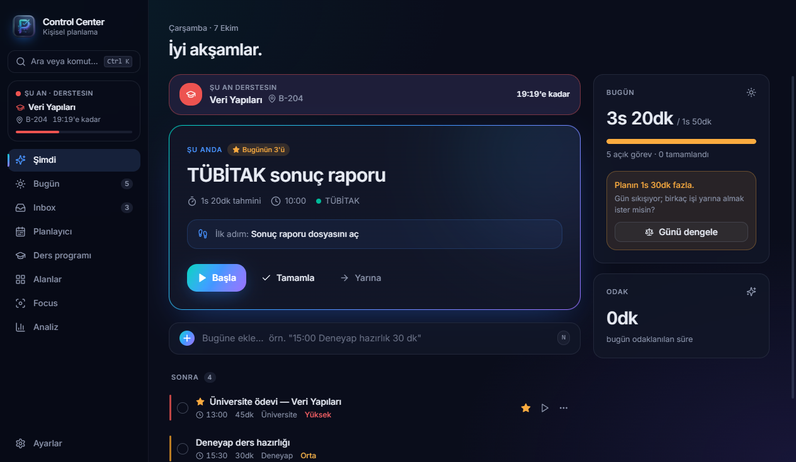
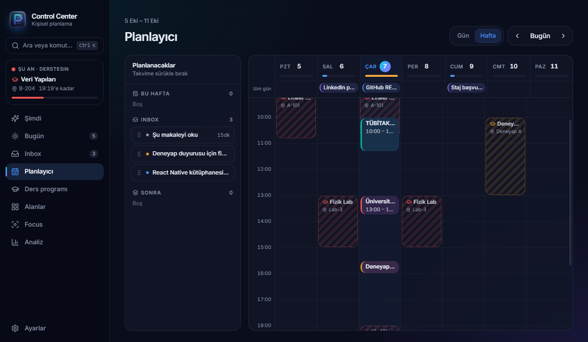
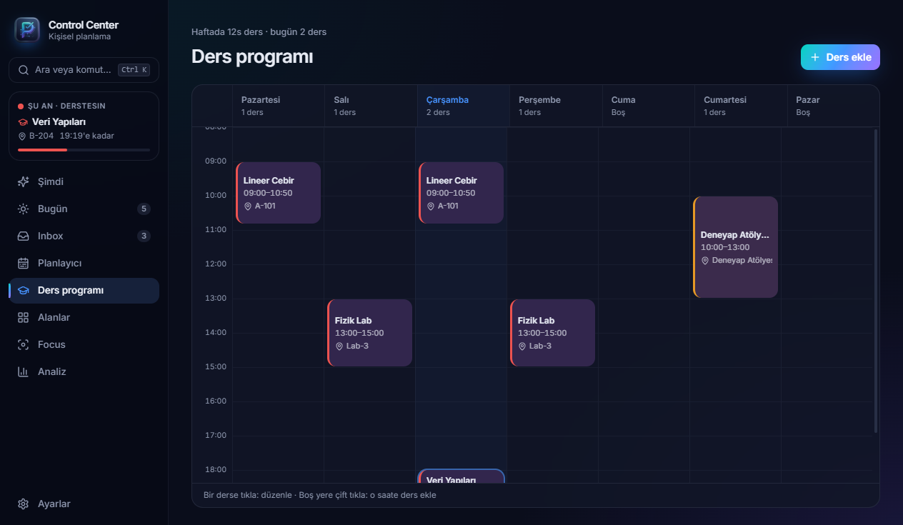
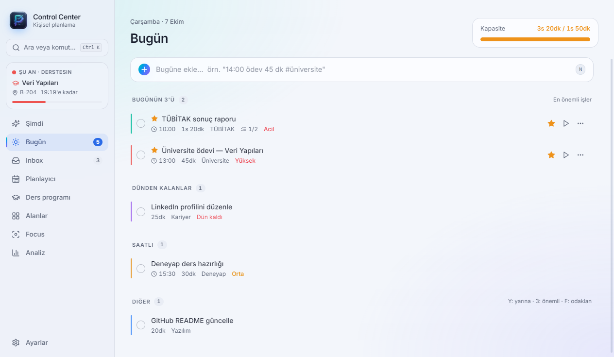
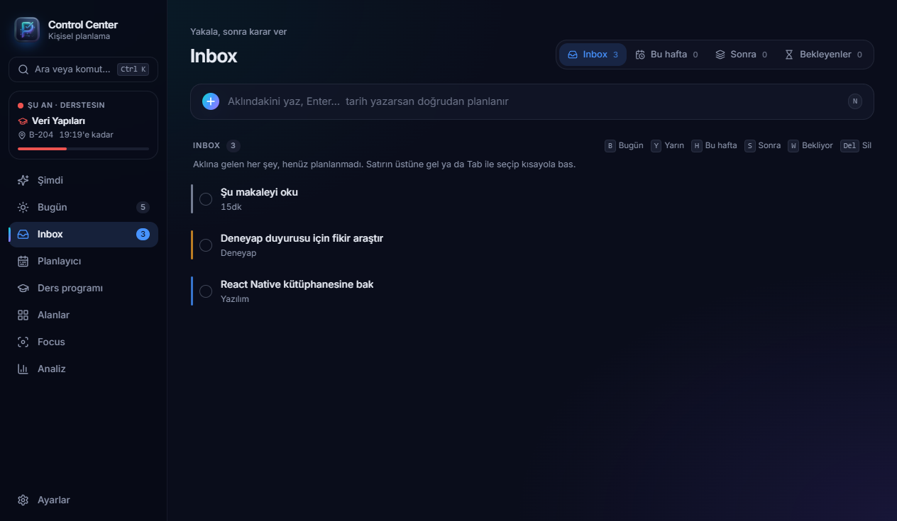

<p align="center">
  
</p>

<h1 align="center">Control Center</h1>

<p align="center"><b>Todo Manager değil, Personal Planning Engine.</b><br/>
Aklında tutma. Planına bırak.</p>

Üniversite, yazılım projeleri, Deneyap, TÜBİTAK, kariyer ve kişisel işler arasında kaybolmamak için yapılmış bir masaüstü planlama uygulaması. Görevleri listelemek yerine tek bir soruyu cevaplar: **"Şu anda ne yapmalıyım?"**



## Neyi farklı yapıyor?

- **"Şimdi ne?" motoru:** Çalışan oturum → saati gelmiş blok → Bugünün 3'ü → teslimi yakın → öncelik sırasıyla tek bir görevi öne çıkarır, ilk fiziksel adımıyla birlikte.
- **Gerçekçi kapasite:** Her gün için ayrı kapasite; ders programındaki saatler otomatik düşülür. Plan aşılırsa **Günü dengele** neyin yarına taşınabileceğini önerir. Hiçbir şeyi sormadan taşımaz.
- **Tahmin ve gerçek:** Focus oturumları gerçek süreyi ölçer. Analiz ekranı tahmin alışkanlığını gösterir ("işlerin genelde %30 uzun sürüyor").
- **Türkçe doğal dil:** `yarın 14:00 TÜBİTAK raporu 2 saat !!` yazınca tarih, saat, süre, öncelik ve alan otomatik ayrışır. `ödev` yazınca alanı Üniversite, `github` yazınca Yazılım olur.
- **Nerede olduğunu bilir:** Kenar çubuğunda her an "Şu an · Derstesin: Veri Yapıları · B-204 · 11:00'e kadar" ve "Sırada" görünür.

## Özellikler

| | |
|---|---|
| **Şimdi** | ŞİMDİ kartı, ilk adım, Başla / Tamamla / Yarına; gün kapasitesi, odak süresi, Günü dengele |
| **Bugün** | Bugünün 3'ü · Dünden kalanlar · Saatli · Diğer · Takip et · Tamamlanan |
| **Inbox** | Inbox / Bu hafta / Sonra / Bekleyenler; `B Y H S W Del` kısayollarıyla hızlı triage, her işlemde **Geri al** |
| **Planlayıcı** | Haftalık ve günlük takvim, sürükle-bırak, blok boyutlandırma, şimdi çizgisi, derslerle çakışma uyarısı |
| **Ders programı** | Haftalık sabit program (ders, iş, atölye); yer, dönem başı/sonu, çoklu gün |
| **Focus** | İki mod: **Pomodoro** (25/5, her 4 turda 15 dk; tur noktaları, mola ipuçları, zil ve masaüstü bildirimi, süreler ayarlanabilir) ve **Serbest** (tahmine karşı halkalı sayaç). İlk adımdaki dosya / klasör / bağlantı Başla ile açılır |
| **Alanlar** | Alan ekle, düzenle, sırala, renk ve simge seç; haftalık plan / gerçek |
| **Analiz** | Planlanan, odak, tamamlanan, erteleme; günlük odak; alanlara göre plan ve gerçek |
| **Tekrarlayan görevler** | Her gün / hafta içi / seçili günler / her ay; bugün ve yarın için otomatik üretilir |
| **Sabah planlama** | 3 adım, 2 dakika: dünden kalanlar → Inbox → Bugünün 3'ü; gün başı bildirimi buraya açılır |
| **Gün kapanışı** | Tamamlananlar, odak, tahmin → gerçek; kalanları yerleştir, yarına tek satır not (ertesi sabah görünür) |
| **Kaç dakikam var?** | Boş süreni seç (15 dk – 3 saat); o süreye en iyi sığan işler seçilir, tek tıkla başla ya da takvime arka arkaya yerleştir |
| **Enerji** | "Bugün nasılsın? 😴 🙂 🔥" — düşük enerjide küçük işler, yüksekte büyük işler öne çıkar |
| **Parçalama** | Büyük veya çok ertelenen görevlerde öneri; rapor / ödev / sunum / kod şablonları, günlere dağıtma (kapasite ve dersler hesaba katılır) |
| **Bağlam** | "Neredesin? 💻 📱 🏠 🎓 🌐 👥" — orada yapılamayacak işler öneriden çıkar; hızlı eklemede `@telefon`, `@bilgisayar` |
| **Kişisel tahmin** | Geçmiş işlerine göre çarpan (alan bazında): "Bu alandaki işlerin tahminin 1,5 katı sürüyor — 1s 30dk yap" |
| **Erteleme nedeni** | 3. ertelemede "Neden?" sorulur ve somut bir sonraki adım önerilir; Analiz'de en sık sürtünme noktası görünür |
| **Bekleyenler** | "Hocadan geri dönüş" gibi başkasından beklenen işler; takip günü Bugün'e düşer |
| **Arama** | SQLite FTS5 tam metin arama; Türkçe karakter duyarsız (`tubitak` → TÜBİTAK); `Ctrl+K` komut paleti |

### Masaüstü

- **Her yerden hızlı ekleme:** `Ctrl+Space` → ekranın ortasında küçük pencere (kısayol Ayarlar'dan değiştirilebilir).
- **Sistem tepsisi:** Çalışan sayaç ipucunda görünür; sağ tıkla odak başlat / duraklat, hızlı ekle.
- **Bildirimler:** Görev ve derslerden N dakika önce ve başlarken, gün başı özeti, odak tahmini aşılınca.
- Kapatınca tepsiye küçülür; Windows açılışında tepside başlayabilir. `Ctrl+Shift+F` her yerden Focus.

### Giriş ve profiller

- Açılışta **giriş ekranı: e-posta + şifre** ya da **Google ile devam et**. E-postası olmayan eski profillere adla girilir; e-posta Ayarlar'dan eklenir. "Beni hatırla" yalnızca e-postayı hatırlar. Birden fazla profil olabilir (ör. sen ve kardeşin); her profilin görevleri, ders programı, ayarları ve yedekleri **ayrı veritabanında** durur, profiller birbirinin planlayıcısını göremez.
- `Ctrl+L` ya da tepsi menüsünden **Kilitle**: giriş ekranına döner, arka plan bildirimleri ve global kısayollar durur.
- Ayarlar → Profil ve güvenlik: ad, şifre değiştir, profili sil (şifreyle onay). 3 yanlış denemeden sonra bekleme süresi artar.
- Şifreler scrypt ile tuzlanmış özet olarak saklanır; şifre unutulursa geri getirilemez. Not: veritabanı dosyaları diskte şifrelenmez, koruma uygulama ve Windows hesabı düzeyindedir.

#### Google ile giriş kurulumu

Google girişi sistem tarayıcısında açılır (OAuth 2.0 + PKCE, 127.0.0.1 yönlendirmesi); şifren uygulamaya gelmez, yalnızca doğrulanmış e-posta alınır ve aynı e-postalı profil açılır. Profil yoksa e-postası dolu bir profil formu gelir.

1. [Google Cloud Console](https://console.cloud.google.com/apis/credentials) → **Kimlik bilgileri oluştur → OAuth istemci kimliği → Masaüstü uygulaması**.
2. İndirdiğin JSON'u `google-oauth.json` adıyla uygulama veri klasörüne koy (giriş ekranında Google düğmesine basınca tam yolu gösterir; geliştirmede `%APPDATA%\control-center\`). Alternatif: `GOOGLE_CLIENT_ID` / `GOOGLE_CLIENT_SECRET` ortam değişkenleri.
3. Şifreni unutursan: profilin e-postası Google hesabınla aynıysa Google ile gir, Ayarlar → Profil ve güvenlik'ten eski şifreyi bilmeden yenisini belirle.

### E-posta → Inbox

Ayarlar → Genel → **E-posta hesabı bağla**: Gmail, Outlook, Yandex, iCloud ya da herhangi bir IMAP sunucusu. Normal hesap şifresi değil, sağlayıcının verdiği **uygulama şifresi** kullanılır (pencerede adım adım anlatılır, ilgili sayfaya bağlantı vardır).

- Hangi e-postalar görev olsun: **yıldızlılar** (önerilen), okunmamışlar ya da tümü. Görevlerin düşeceği alan seçilebilir.
- Her 10 dakikada bir (ve "Şimdi kontrol et" ile) kontrol edilir; ilk bağlantıda ve sonrasında hesap bağlanmadan 7 gün öncesinden eski e-postalar alınmaz. Aynı e-posta iki kez görev olmaz.
- Gelen kutusu salt okunur açılır, e-postalarına dokunulmaz. Gmail'den gelen görevde "Başla" e-postayı tarayıcıda açar.
- Uygulama şifresi Windows şifrelemesiyle (Electron `safeStorage`) saklanır, arayüze geri gönderilmez. Her profil kendi hesaplarını bağlar.
- Not: Microsoft kişisel Outlook.com hesaplarında uygulama parolasıyla IMAP'i kısıtlıyor; bağlantı reddedilebilir.

### Veri

- Her şey bu bilgisayarda, **SQLite** içinde. Sunucu yok, bulut hesabı yok.
- **Otomatik günlük yedek** (son 7), yedeğe tek tıkla dönme.
- **JSON dışa / içe aktarma.** İçe aktarmadan önce mevcut veri otomatik yedeklenir.

<p>
  
  
</p>
<p>
  
  
</p>
<p align="center"></p>

## Kurulum

### Hazır kurulum dosyası (Windows)

`dist/Control-Center-Setup-<sürüm>.exe` dosyasını çalıştır. Kaldırınca görevlerin ve yedeklerin silinmez (`%APPDATA%\control-center`).

### Kaynaktan

Gereksinimler: Node.js 20+, Windows için Visual Studio Build Tools (better-sqlite3 yerel modülü için).

```bash
git clone <repo>
cd To_Do_List
npm install          # better-sqlite3 Electron için otomatik derlenir
npm run dev          # geliştirme
```

| Komut | Ne yapar |
|---|---|
| `npm run dev` | Geliştirme modu (sıcak yenileme) |
| `npm run build` | `out/` klasörüne derler |
| `npm run typecheck` | TypeScript kontrolü (main + renderer) |
| `npm test` | Birim testleri (Vitest) |
| `npm run pack` | Kurulumsuz paket: `dist/win-unpacked/` |
| `npm run dist` | Windows kurulum dosyası: `dist/Control-Center-Setup-*.exe` |

## Kısayollar

Varsayılanlar aşağıda. **Hepsi Ayarlar → Klavye kısayolları'ndan değiştirilebilir:** satıra tıkla, yeni tuşlara bas. Çakışmalar uyarılır, satır satır ya da hepsi birden varsayılana dönülebilir.

| Kısayol | |
|---|---|
| `Ctrl+Space` | Her yerden hızlı görev ekle |
| `Ctrl+Shift+F` | Her yerden Focus |
| `Ctrl+K` | Ara ve komut paleti |
| `Ctrl+L` | Kilitle (giriş ekranı) |
| `Ctrl+1 … 8` | Sayfalar |
| `N` | Yeni görev yaz |
| `Enter` / `X` / `F` | Aç / Tamamla / Odaklan |
| `B` `Y` `H` `S` | Bugün / Yarın / Bu hafta / Sonra |
| `3` / `W` / `Del` | Bugünün 3'ü / Bekliyor / Sil |

## Mimari

```
Electron
├── main      src/main       SQLite (better-sqlite3), migration'lar, IPC, bildirimler,
│                            tepsi, global kısayollar, yedekleme, tekrar zamanlayıcısı
├── preload   src/preload    contextBridge ile tip güvenli window.api
├── renderer  src/renderer   React 18 + TypeScript + Tailwind v4 + shadcn/ui (Radix)
└── shared    src/shared     Saf mantık + testler: doğal dil ayrıştırma, "Şimdi ne?" sıralaması,
                             günü dengeleme, ders programı / kapasite, tekrar kuralları, tarih
```

- Renderer veritabanına doğrudan erişmez: `contextIsolation: true`, `nodeIntegration: false`. API sözleşmesi `src/shared/types.ts` → `IElectronAPI`.
- Migration'lar `src/main/db/migrations/` altında numaralıdır ve derlemeye gömülür. Eski dosyalar asla değiştirilmez.
- Tasarım kuralları: `.agent/skills/planner-ui-ux/SKILL.md`.

## Yol haritası

- [x] V1: görevler, Inbox, Bugün, kapasite, zaman bloklama, odak takibi, tekrarlayan görevler, ders programı, bildirimler, tepsi, hızlı ekleme, yedek, FTS5
- [x] V1.5: çalıştırılabilir ilk adım, Bekleyenler, tahmin alışkanlığı
- [x] Sabah planlama ve gün kapanışı ritüeli
- [x] "Bugün sadece 2 saatim var" (tek güne özel kapasite)
- [x] Düzenlenebilir klavye kısayolları
- [x] V2: "Kaç dakikam var?", enerjiye göre sıralama, erteleme nedeni, büyük görevleri parçalama ve günlere dağıtma
- [x] Bağlam filtreleri ("Neredesin?", `@telefon`), kişisel tahmin çarpanı önerisi
